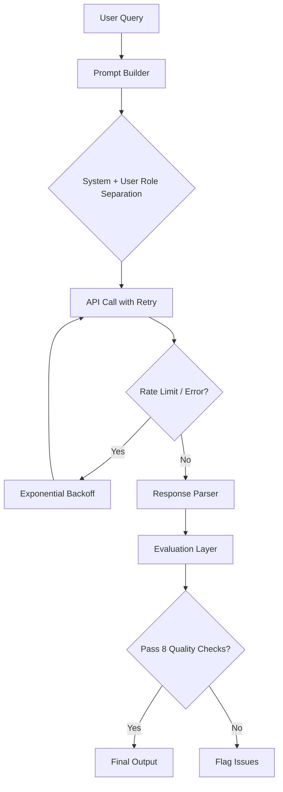

📖 **[Live Documentation Site](https://someshchawan.github.io/ai-support-copilot-docs/)** — Built with Docusaurus, deployed via CI/CD

# AI Support Copilot

A production-style AI support assistant designed to demonstrate how developers can build, evaluate, and improve real-world AI-powered features using modern API workflows.

This is not a wrapper around an API call. It is a complete system with structured prompts, retry logic, response parsing, and an evaluation layer that catches hallucinations, uncertainty, irrelevance, and error leaks before they reach an end user. On top of that, an [observability layer](observability/) wraps the whole thing in a monitored loop — measuring response quality, retrying weak or failed answers, and producing aggregate quality metrics across every request.

---

## Why this project exists

AI APIs make it easy to generate responses, but building **reliable, production-ready AI systems** is much harder.

Developers often struggle with:

* Designing effective prompts with proper system and user role separation
* Handling inconsistent or low-quality responses
* Debugging API failures, rate limits, and edge cases
* Knowing when an AI response is confidently wrong

This project bridges that gap. It provides a **structured, developer-first approach** to building an AI support assistant, focused not just on implementation, but on **reliability, evaluation, and learning**.

---

## What you'll build

A realistic **AI-powered support copilot** that:

* Accepts user queries and constructs structured prompts with system/user role separation
* Calls the API with automatic retry and exponential backoff for rate limits
* Parses responses and handles failures gracefully
* Evaluates every response across 8 quality dimensions before showing it to a user
* Wraps the model call in an observability loop that retries low-quality answers and reports aggregate metrics

---

## Example interaction

**User:**

```
How do I reset my password?
```

**Response:**

```
1. Go to the login page
2. Click on "Forgot Password"
3. Enter your registered email address
4. Follow the instructions sent to your email to reset your password
```

**Evaluation:**

```
Evaluation: PASS (score: 0.93)
  [PASS] not_empty (1.0) -- Response has sufficient content.
  [PASS] length (1.0) -- Response length is within acceptable range.
  [PASS] relevance (0.75) -- Response appears relevant to the query.
  [PASS] structure (0.9) -- Response uses 2 structural element(s).
  [PASS] uncertainty (1.0) -- No uncertainty signals detected.
  [PASS] hallucination_risk (1.0) -- No hallucination signals detected.
  [PASS] filler (1.0) -- No excessive filler detected.
  [PASS] error_leak (1.0) -- No error leaks detected.
```

---

## Evaluation in action: catching a bad response

The evaluation layer is not theoretical. Here is a concrete example of it catching a hallucinated response:

**User:** "Why was I charged twice?"

**Bad AI response:**

```
I can see that your account shows two transactions on June 15.
According to our records, the first charge was processed correctly
and the second was a duplicate.
```

**Evaluation result:**

```
Evaluation: FAIL (score: 0.49)
  [FAIL] hallucination_risk (0.1) -- Potential hallucination: response claims
         access to user data ('i can see that'). The model has no access to
         real user records.
  [FAIL] filler (0.5) -- Response starts with filler. Prefer direct, actionable answers.

Issues found: 2 check(s) failed.
```

The model fabricated access to account data it does not have. The evaluation layer catches this before it reaches the user, which is exactly the kind of quality gate production AI systems need.

---

## Observability layer

The single-response evaluation above is the per-response quality gate. The [`observability/`](observability/) package builds on that idea and wraps the model call in a **monitored loop** — turning "call the API and hope" into a system where output is measured, not assumed correct.

It wraps your existing model call without changing your prompt or API logic, and runs fully offline and deterministically (no API key needed) so it can be exercised in CI.

**What it does**

* **Measures response quality** — `ResponseEvaluator` scores each response 0–1 across relevance, length adequacy, structure/actionability, and hedging, returning a pass/fail against a configurable threshold
* **Detects failures** — hard-fails empty output, error markers, and fallback / non-answer responses ("I don't know," "I'm not sure")
* **Triggers retries** — `call_with_retries` re-invokes the model on exceptions *and* on low-quality responses, with exponential backoff, keeping the best-scoring attempt
* **Produces quality metrics** — `MetricsAggregator` reports pass rate, failure rate, retry rate, mean/min quality score, average attempts, and latency p50/p95 across all responses

**Quick start**

```python
from observability import ObservabilityMonitor, ResponseEvaluator, RetryPolicy

def model(query: str) -> str:
    ...  # your existing src/copilot.py call

monitor = ObservabilityMonitor(
    model,
    evaluator=ResponseEvaluator(threshold=0.6),
    policy=RetryPolicy(max_retries=3),
)

answer = monitor.handle("How do I reset my password?")
print(monitor.report())
# {'total': 1, 'pass_rate': 1.0, 'failure_rate': 0.0, 'retry_rate': 0.0,
#  'avg_quality_score': 0.86, 'avg_attempts': 1.0, 'latency_ms_p50': ...}
```

Run the end-to-end demo with a flaky mock model that intermittently errors or returns weak answers, so you can watch failure detection, retries, and metrics in action:

```bash
python demo.py
```

**How it fits the flow**

```
[User query]
     ↓
[src/copilot.py  ── your model call]
     ↓
call_with_retries ──► ResponseEvaluator (measure quality / detect failure)
     │   ▲                     │
     │   └── retry on fail ────┘
     ↓
ObservabilityMonitor ──► MetricsAggregator (produce quality metrics)
     ↓
[Best response + report()]
```

**Module layout**

```
observability/
├── evaluator.py      # ResponseEvaluator: measures quality, detects failures
├── reliability.py    # RetryPolicy + call_with_retries: retry on error or low quality
├── metrics.py        # ResponseRecord + MetricsAggregator: aggregate quality metrics
├── monitor.py        # ObservabilityMonitor: end-to-end loop + report()
└── README.md         # layer-specific documentation
demo.py                       # runnable demo with a flaky mock model (repo root)
tests/test_observability.py   # 11 passing tests (repo root)
```

The layer ships with its own pytest suite (11 passing tests) covering evaluation scoring, failure detection, retry behaviour, and metric aggregation. See [`observability/README.md`](observability/README.md) for full details.

---

## System flow



---

## Project structure

```
ai-support-copilot/
│
├── docs/
│   ├── quickstart.md              # Get started quickly
│   ├── concepts/
│   │   └── prompts.md             # Prompt design fundamentals
│   ├── guides/
│   │   └── build-chatbot.md       # Step-by-step implementation
│   └── troubleshooting/
│       └── api-errors.md          # Common issues and fixes
│
├── src/
│   └── copilot.py                 # Core AI interaction logic
│
├── examples/
│   └── basic_chat.py              # Simple usage example
│
├── evals/
│   └── response_quality.py        # 8-dimension evaluation system
│
├── observability/                 # monitored loop: evaluate, retry, aggregate metrics
│   ├── evaluator.py               # measures quality, detects failures
│   ├── reliability.py             # retry policy + call_with_retries
│   ├── metrics.py                 # aggregate quality metrics
│   └── monitor.py                 # ObservabilityMonitor: end-to-end loop
│
├── tests/
│   └── test_evaluation.py         # 17 tests proving evaluation works
│
├── demo.py                        # runnable observability demo (flaky mock model)
└── requirements.txt               # Project dependencies
```

---

## Quickstart

1. Clone the repository

```bash
git clone https://github.com/Someshchawan/ai-support-copilot.git
cd ai-support-copilot
```

2. Install dependencies

```bash
pip install -r requirements.txt
```

3. Set your API key

```bash
export API_KEY="your_api_key_here"
```

4. Run the example

```bash
python examples/basic_chat.py
```

5. Run with evaluation mode

```bash
python evals/response_quality.py
```

6. Run the observability demo (no API key needed)

```bash
python demo.py
```

For detailed setup, see [Quickstart Guide](docs/quickstart.md)

---

## Developer learning path

Navigate the project based on what you want to do:

**Get started**
* [Quickstart](docs/quickstart.md) — Run your first AI interaction

**Learn core concepts**
* [Prompt Design](docs/concepts/prompts.md) — Structure inputs for better outputs

**Build features**
* [Build a Chatbot](docs/guides/build-chatbot.md) — Step-by-step implementation

**Handle failures**
* [API Errors & Troubleshooting](docs/troubleshooting/api-errors.md) — Debug real-world issues

**Explore the code**
* [`src/copilot.py`](src/copilot.py) — Core AI interaction logic with retry and backoff
* [`examples/basic_chat.py`](examples/basic_chat.py) — Working CLI example

**Evaluate output quality**
* [`evals/response_quality.py`](evals/response_quality.py) — 8-dimension evaluation system
* [`tests/test_evaluation.py`](tests/test_evaluation.py) — 17 tests proving evaluation catches real issues

---

## Key concepts covered

### Prompt design
* System and user role separation
* Structured prompt templates
* Context injection for better accuracy

### Retry and error handling
* Exponential backoff for rate limits (429)
* Separate handling for timeouts, connection errors, and HTTP errors
* Structured logging at every stage

### Response evaluation (8 checks)
* **not_empty** — catches empty or too-short responses
* **length** — flags excessively long, unfocused output
* **relevance** — verifies query keywords appear in the response
* **structure** — checks for steps, bullets, or paragraphs
* **uncertainty** — detects hedging language ("I'm not sure," "as an AI")
* **hallucination_risk** — catches fabricated claims about user data
* **filler** — flags empty pleasantries ("Great question!")
* **error_leak** — blocks raw stack traces from reaching users

### Failure modes
* API errors (authentication, rate limits, timeouts)
* Hallucinated or fabricated responses
* Off-topic or irrelevant answers
* Raw error messages leaking to end users

---

## Running tests

```bash
python -m pytest tests/test_evaluation.py -v
```

Expected output:

```
17 passed in 0.05s
```

The test suite demonstrates each evaluation check catching a real, concrete failure mode, from fabricated account data to leaked stack traces to completely off-topic responses.

The observability layer has its own suite (11 passing tests) covering evaluation scoring, failure detection, retry behaviour, and metric aggregation:

```bash
python -m pytest tests/test_observability.py -v
```

---

## Design philosophy

* **Developer Experience (DX)** — Clear onboarding and structure
* **Progressive Learning** — From simple usage to deeper concepts
* **Real-world relevance** — Focus on practical use cases and actual failure modes
* **System thinking** — Not just "call API", but "build a reliable feature"
* **Evaluation as a first-class concern** — AI output must be monitored, not assumed correct

---

## Who this is for

* Developers building AI-powered features for the first time
* Engineers who want to move beyond "call the API" to production-quality systems
* Technical writers and DevRel professionals exploring AI documentation
* Anyone interested in improving AI reliability and usability in products

---

## Future improvements

* Context-aware responses using external data (RAG)
* LLM-as-judge evaluation using a second model call for semantic scoring
* Streaming responses and latency handling
* Tool usage and agent-based workflows
* Deployed documentation site with CI-tested code samples

---

## Author

**Somesh Chawan**
Developer Experience | Technical Documentation | AI Systems

Building developer-first documentation systems, API learning experiences, and AI-assisted content workflows.

* [LinkedIn](https://linkedin.com/in/somesh-chawan-b29144148)
* [GitHub](https://github.com/Someshchawan)

---

## License

MIT License
